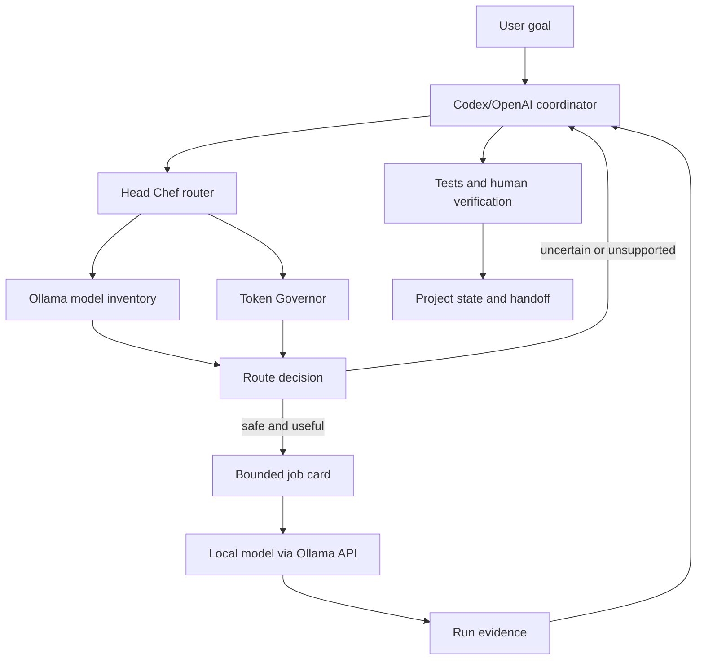
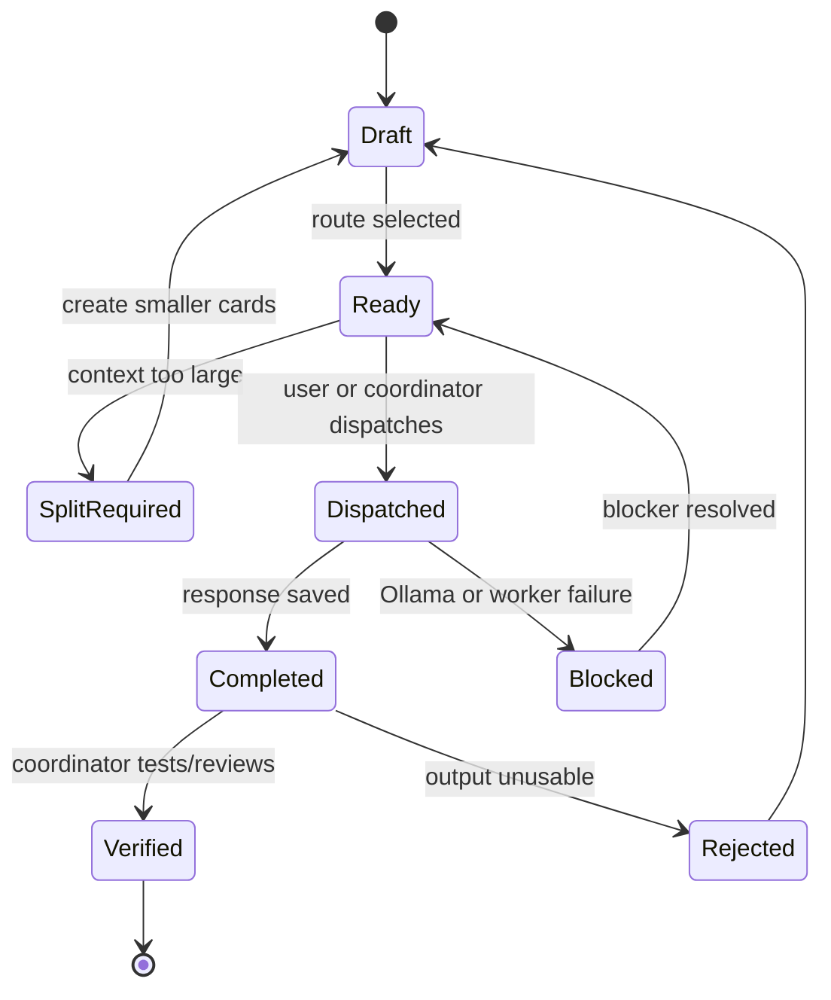

# Architecture

## Design principles

1. **Coordinator-first:** Codex/OpenAI owns planning and verification.
2. **Local-first execution assistance:** use installed Ollama models when the task is bounded and low-risk.
3. **Progressive disclosure:** load only the task, allowed files, acceptance criteria, and necessary context.
4. **Transparent routing:** every recommendation includes candidate scores and reasons.
5. **No hidden autonomy:** local workers cannot execute commands through Head Chef.
6. **External memory:** project state lives in files, not assumed model memory.
7. **Fail open to the coordinator:** when routing is uncertain, keep the task with Codex/OpenAI.

## Component map



## Runtime boundaries

### CLI layer

`head_chef.cli` parses user-friendly commands and produces JSON that Codex can consume reliably.

### Ollama adapter

`head_chef.ollama` uses the local HTTP API for model inventory, model metadata, chat, and timing data. It has no model-download operation.

### Model profiler

`head_chef.models` converts Ollama metadata into a conservative local profile. Name-based capability inference is visible and fallible; future model overrides and benchmark evidence should supersede it.

### Router

`head_chef.router` classifies the task, scores all viable installed models, rejects incompatible models, and returns an explainable decision.

### Token Governor

`head_chef.token_governor` estimates context pressure. Its estimate is intentionally conservative and is not a billing counter.

### Job cards

`head_chef.jobs` creates durable JSON contracts with:

- exact task;
- selected model;
- allowed and forbidden files;
- exclusions;
- acceptance criteria;
- test commands;
- review requirements;
- split status.

### Evidence store

`.head-chef/` contains project-local configuration, jobs, run results, benchmark results, blockers, and handoffs. Generated state is ignored by Git by default because prompts and outputs may contain private project data.

## Routing policy

The router uses four evidence classes:

1. **Task signals:** coding, vision, planning, retrieval, writing, or general analysis.
2. **Model metadata:** family, size, quantization, context, and advertised capabilities.
3. **Conservative name signals:** for example, `coder`, `vl`, or `embedding`.
4. **Optional local benchmark:** a tiny structured-output smoke test.

The router must not present heuristic scores as objective model truth.

## State lifecycle



## Future extension points

Deferred interfaces may later support:

- explicit model override files;
- project templates;
- richer benchmark suites;
- a Codex command wrapper;
- read-only repository context packaging;
- optional dashboard;
- optional remote Ollama endpoints;
- retrieval from project summaries.

They must preserve the same authority and evidence boundaries.
# v0.2 kitchen model

Codex remains head chef. Local models are bounded stations:

```text
Codex task profile
  -> hard modality/capability/local-only gate
  -> station candidates
  -> digest + task benchmark + observed success/latency + context fit
  -> bounded job and typed executor
  -> structured result
  -> verification and coordinator review
  -> immutable outcome evidence feeds next route
```

Specialist names narrow capability inference. Coder, story/writing, vision-language, and embedding models do not inherit unrelated family roles. Generalists cover planning, analysis, writing, and retrieval only when metadata/inference supports them.
